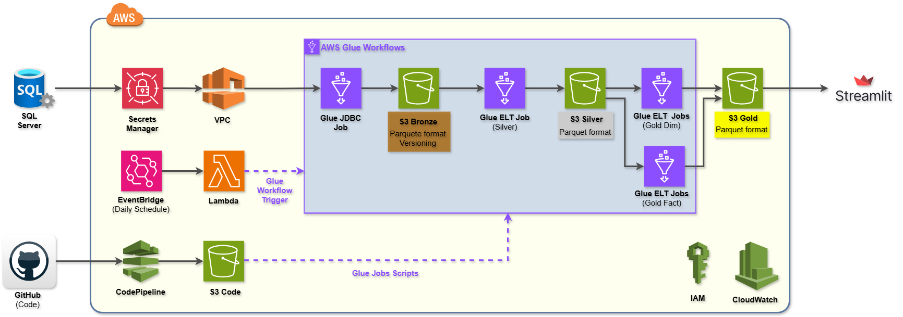

# Project 3: Business Insights Assessment

This project delivers a **cost-efficient**, fully **serverless** batch data pipeline built on **AWS managed services** and designed using a **Bronze–Silver–Gold lakehouse architecture**. The solution ensures a clear separation of concerns across data lifecycle stages, enabling:

- **Reliability**
- **Scalability**
- **Security**
- **Maintainability**

---

## Data Ingestion (Bronze Layer)

Raw data is securely ingested from **SQL Server** and preserved in the **Bronze layer** to guarantee:

- Data lineage
- Auditability
- Traceability

---

## Data Transformation (Silver Layer)

The **Silver layer** applies:

- Standardized transformations  
- Data quality rules  
- Schema enforcement  

This produces clean, reliable **dimension** and **fact tables** ready for downstream analysis.

---

## Analytics & Aggregation (Gold Layer)

The **Gold layer** stores analytics-ready, pre-aggregated Parquet datasets optimized for:

- High-performance querying
- Downstream consumption by BI tools and dashboards

---

## Security

To ensure data security at rest, all **Amazon S3 buckets** (Bronze, Silver, Gold) are protected using:

- Server-Side Encryption with **AWS Key Management Service (SSE-KMS)**
- Centralized key management
- Fine-grained access control through **IAM policies**

---

## Orchestration & CI/CD

The pipeline is **automated, event-driven, and dependency-aware**, orchestrated through:

- **AWS Glue Workflow**
- Integrated **CI/CD process** for **version-controlled development** and **seamless deployment**

**Streamlit dashboards** consume the **Gold-layer datasets** directly from **Amazon S3**, ensuring fast access to trusted business metrics with minimal operational overhead.

---

## Summary

This architecture provides a **scalable, maintainable, and production-ready foundation** for:

- **Data analytics**
- **Business intelligence**

while minimizing **infrastructure management** and **operational costs**.

 

